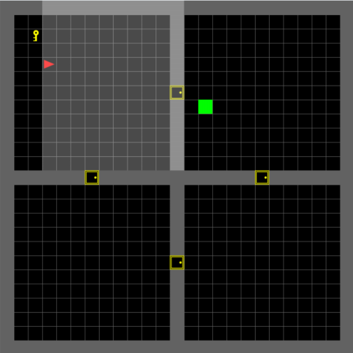

# Effective Exploration via Intrinsic Motivation in Reinforcement Learning

This project is a reinforcement learning model that uses a Deep Q-Network (DQN) to train an agent in a custom
environment. The agent's task is to traverse rooms to reach a goal. The project uses the Ray RLlib library for
reinforcement learning and the MiniGrid environment.

## Getting Started

These instructions will get you a copy of the project up and running on your local machine for development and testing
purposes.

### Prerequisites

The project requires Python 3.9.13 and pip installed on your machine. You can download Python
from [here](https://www.python.org/downloads/) and pip is included in Python 3.9 and later versions.

### Installing

Clone the repository to your local machine.

```bash
git clone https://github.com/berkayeren/rl-learning.git
```

Navigate to the project directory.

```bash
cd /rl-learning
```

Create a virtual environment.

```bash
python -m venv env
```

Activate the virtual environment.

On Windows:

```bash
.\env\Scripts\activate
```

On Unix or MacOS:

```bash
source env/bin/activate
```

Install the required packages.

```bash
pip install -r requirements.txt
```

For running it on windows with CUDA 12.1;

```bash
pip install -r requirements-cuda121.txt
```

## Training the Agent



You can train the agent using the `custom_train.py` script. The script takes command line arguments for the render mode,
number of rollout workers, number of environments per worker, and number of GPUs to use.

Here is an example of how to run the script:

```bash
/Users/berkayeren/PycharmProjects/rl-learning/ray242/.venv/bin/python /Users/berkayeren/PycharmProjects/rl-learning/trainer.py --run_mode experiment --num_rollout_workers 4 --num_envs_per_worker 8 --num_gpus 0 --environment four_rooms --num_samples 4 --max_steps 1444 --timesteps_total 5000000 --trail_name PPO_4Room_dv2_search_5m_maxstep --obs_type flat --enable_dowham_reward_v2
```

In this example, the render mode is set to "human", the number of environments per worker is set to 1, the number of
rollout workers is set to 1, and the number of GPUs is set to 0.

## Built With

* [Python](https://www.python.org/)
* [Ray RLlib](https://ray.readthedocs.io/en/latest/rllib.html)
* [MiniGrid](https://github.com/maximecb/gym-minigrid)

## Authors

* Berkay EREN - [berkayeren](https://github.com/berkayeren)

## License

This project is licensed under the MIT License - see the [LICENSE.md](LICENSE.md) file for details
