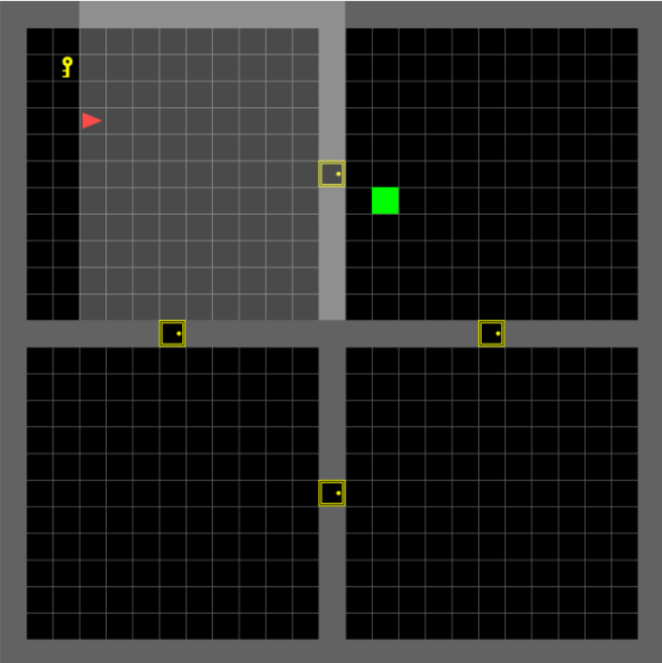

# Effective Exploration via Intrinsic Motivation in Reinforcement Learning

This project trains a reinforcement learning agent with Proximal Policy Optimization (PPO), augmented by intrinsic
motivation (exploration) bonuses, in custom MiniGrid environments. The agent's task is to traverse rooms to reach a
goal. The project uses the Ray RLlib library for reinforcement learning and the MiniGrid environment.

## Abstract

Reinforcement learning agents often struggle in sparse-reward environments where feedback is limited and appears only
after a sequence of correct actions. In partial-observable navigation tasks, simple exploration strategies are often
insufficient. This thesis investigates intrinsic motivation mechanisms, specifically focusing on the "Don't Do What
Doesn't Matter" (DoWhaM) method, which rewards rare but effective actions. To address its limitations in spatial tasks,
we propose Area-aware DoWhaM Adaptation (ADA). This method extends action-usefulness with spatial novelty bonuses to
encourage expanding the visible area. We evaluate ADA against DoWhaM and a Count-Based baselines in various MiniGrid
environments. Results indicate that ADA improves sample efficiency in the early stages of training. In dynamic
environments where the layout changes in every episode, ADA significantly outperforms the Count-Based baseline and
learns faster than DoWhaM. These findings suggest that combining action-usefulness with spatial novelty provides a
robust heuristic for exploration in procedurally generated tasks.

## Getting Started

These instructions will get you a copy of the project up and running on your local machine for development and testing
purposes.

### Prerequisites

The project requires Python 3.9.13 and pip installed on your machine. You can download Python
from [here](https://www.python.org/downloads/) and pip is included in Python 3.9 and later versions.

### Installing

Clone the repository to your local machine.

```bash
git clone https://github.com/berkayeren/rl-learning.git
```

Navigate to the project directory.

```bash
cd rl-learning
```

Create a virtual environment.

```bash
python -m venv env
```

Activate the virtual environment.

On Windows:

```bash
.\env\Scripts\activate
```

On Unix or macOS:

```bash
source env/bin/activate
```

Install the required packages.

```bash
pip install -r requirements.txt
```

For running it on windows with CUDA 12.1;

```bash
pip install -r requirements-cuda121.txt
```

## Exploration Methods

The agent is trained with PPO and can be augmented with one of several intrinsic motivation (exploration) bonuses,
selected via the `--enable_*` flags. The intrinsic reward is added on top of the sparse extrinsic reward to densify the
training signal in hard-to-explore environments.

* **DoWhaM** (`--enable_dowham_reward_v1`) — the original *Don't Do What Doesn't Matter* method
  (Seurin et al., IJCAI 2021). Instead of rewarding state novelty, it rewards the agent for successfully performing
  actions that are *rarely effective* (e.g. `toggle` opening a door, `pickup` grabbing a key), normalized by an episodic
  state count.
* **ADA** (`--enable_dowham_reward_v2`) — *Area-aware DoWhaM Adaptation*, the spatial extension of DoWhaM proposed in
  this work. See below.
* **Count-based** (`--enable_count_based`) — classic count-based exploration that rewards visiting infrequently seen
  states.
* **RND** (`--enable_rnd`) — Random Network Distillation, which uses the prediction error of a randomly-initialized
  target network as a novelty signal. **Note:** this method is experimental and not fully implemented; it may not work
  correctly and is not recommended for use.

### ADA — Area-aware DoWhaM Adaptation

ADA keeps DoWhaM's core action-usefulness idea but addresses its weakness on spatial navigation tasks, where the
usefulness of an action depends on *where* it is taken and where the original method does not distinguish between
actions
that keep the agent inside already-explored areas and actions that push it into new regions. ADA extends DoWhaM in two
ways:

1. **State-conditioned statistics.** The action usage (`U`) and effectiveness (`E`) counts are indexed by the
   observation hash, so turning in front of a door and turning in an empty room are treated as different contexts.
2. **Two spatial novelty bonuses**, computed from the agent's egocentric view (no access to the global map):
    * **Expansion bonus** — rewards actions that reveal map cells previously outside the field of view.
    * **Achievement bonus** — rewards stepping onto cells that were already *seen* but not yet *visited* (the frontier).

The final intrinsic reward combines the action, expansion, and achievement bonuses and divides them by the square root
of the episodic state count, following DoWhaM's normalization. The implementation lives in
`intrinsic_motivation/dowham_v2.py` (class `DoWhaMIntrinsicRewardV2`). ADA is introduced and derived in full in the
accompanying thesis (see [Citation](#citation)).

## Training the Agent



You can train the agent using the `trainer.py` script. The script takes command line arguments such as the number of
rollout workers, number of environments per worker, number of GPUs, environment, observation type, and reward options.

Here is an example of how to run the script from the project root (this invokes the interpreter from the
`ray242/.venv` virtual environment directly, so you do not need to activate it first):

```bash
./ray242/.venv/bin/python trainer.py --run_mode experiment --num_rollout_workers 4 --num_envs_per_worker 8 --num_gpus 0 --environment multi_room_key --num_samples 10 --max_steps 1444 --timesteps_total 2000000 --trail_name PPO_TwelveRoom_4RoomWithKeyDw2 --obs_type conv --verbose 0 --evaluation_interval 3 --enable_dowham_reward_v2 --num_cpus_per_env_runner 0.5
```

This example trains on the `multi_room_key` environment (a multi-room maze with locked, keyed doors) with 4 rollout
workers and 8 environments per worker (32 total), using CPU only (`--num_gpus 0`). It runs for 2M timesteps with a max
of 1444 steps per episode, uses convolutional observations (`--obs_type conv`), and enables the ADA intrinsic reward
(`--enable_dowham_reward_v2`). The remaining flags:

* `--num_samples 10` — number of seeds to sweep over (one trial per seed).
* `--trail_name PPO_TwelveRoom_4RoomWithKeyDw2` — name used for the Ray Tune experiment directory.
* `--verbose 0` — suppress Ray Tune's detailed progress logs.
* `--evaluation_interval 3` — run evaluation every 3 training iterations.
* `--num_cpus_per_env_runner 0.5` — CPUs allocated per env runner.

### Available command-line arguments

| Argument                    | Default       | Description                                                                                                |
|-----------------------------|---------------|------------------------------------------------------------------------------------------------------------|
| `--run_mode`                | _required_    | `experiment` or `hyperparameter_search`.                                                                   |
| `--environment`             | `empty`       | One of `empty`, `crossing`, `four_rooms`, `multi_room`, `multi_room_key`, `long_corridor`, `twelve_rooms`. |
| `--obs_type`                | `position`    | Observation wrapper: `conv`, `position`, or `flat`.                                                        |
| `--num_rollout_workers`     | `1`           | Number of rollout (env-runner) workers.                                                                    |
| `--num_envs_per_worker`     | `1`           | Environments per worker.                                                                                   |
| `--num_gpus`                | `0`           | GPUs to use.                                                                                               |
| `--num_samples`             | `1`           | Number of seeds to sweep.                                                                                  |
| `--max_steps`               | `200`         | Max steps per episode.                                                                                     |
| `--timesteps_total`         | `100_000_000` | Total training timesteps (stop condition).                                                                 |
| `--num_cpus_per_env_runner` | `0.25`        | CPUs allocated per env runner.                                                                             |
| `--evaluation_interval`     | `3`           | Iterations between evaluations.                                                                            |
| `--verbose`                 | `1`           | Ray Tune log verbosity.                                                                                    |
| `--trail_name`              | `None`        | Custom experiment/trial name.                                                                              |
| `--enable_dowham_reward_v1` | off           | Enable the original DoWhaM intrinsic reward.                                                               |
| `--enable_dowham_reward_v2` | off           | Enable the ADA (Area-aware DoWhaM Adaptation) intrinsic reward.                                            |
| `--enable_count_based`      | off           | Enable count-based exploration.                                                                            |
| `--enable_rnd`              | off           | Enable Random Network Distillation exploration (experimental, not fully implemented — may not work).       |
| `--conv_filter`             | off           | Use a convolutional layer instead of flat observations.                                                    |

## Monitoring with TensorBoard

Ray writes training metrics to a per-session artifacts directory. You can watch them live with TensorBoard by pointing
`--logdir` at the run's `driver_artifacts` folder. The session timestamp and experiment name will match your run, for
example:

```bash
tensorboard --logdir /tmp/ray/session_2026-06-04_19-08-51_786852_46976/artifacts/2026-06-04_19-08-58/PPO_TwelveRoom_4RoomWithKeyDw2/driver_artifacts
```

The exact path is printed by Ray when the run starts; replace the `session_*` and timestamp segments with the values
from your own run (the final directory is named after your `--trail_name`). Then open the URL TensorBoard prints
(by default <http://localhost:6006>) to view episode reward, episode length, the custom exploration metrics, and the
intrinsic/shaped reward curves.

## Built With

* [Python](https://www.python.org/)
* [Ray RLlib](https://ray.readthedocs.io/en/latest/rllib.html)
* [MiniGrid](https://github.com/maximecb/gym-minigrid)

## Authors

* Berkay EREN - [berkayeren](https://github.com/berkayeren)

## Citation

If you use this work, please cite:

> B. EREN, "Effective exploration via intrinsic motivation in reinforcement learning," Yüksek lisans tezi, LİSANSÜSTÜ
> EĞİTİM ENSTİTÜSÜ, İZMİR EKONOMİ ÜNİVERSİTESİ, 2026.

```bibtex
@mastersthesis{eren2026effective,
  title  = {Effective exploration via intrinsic motivation in reinforcement learning},
  author = {Eren, Berkay},
  school = {İzmir Ekonomi Üniversitesi, Lisansüstü Eğitim Enstitüsü},
  year   = {2026},
  type   = {Yüksek lisans tezi}
}
```

## License

This project is licensed under the MIT License - see the [LICENSE.md](LICENSE.md) file for details
